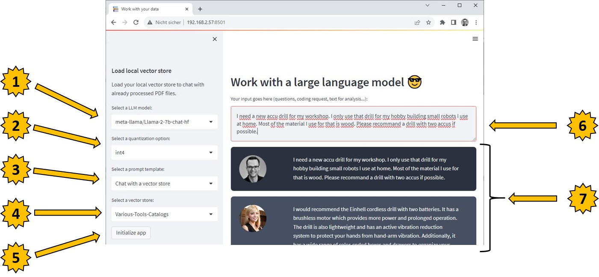
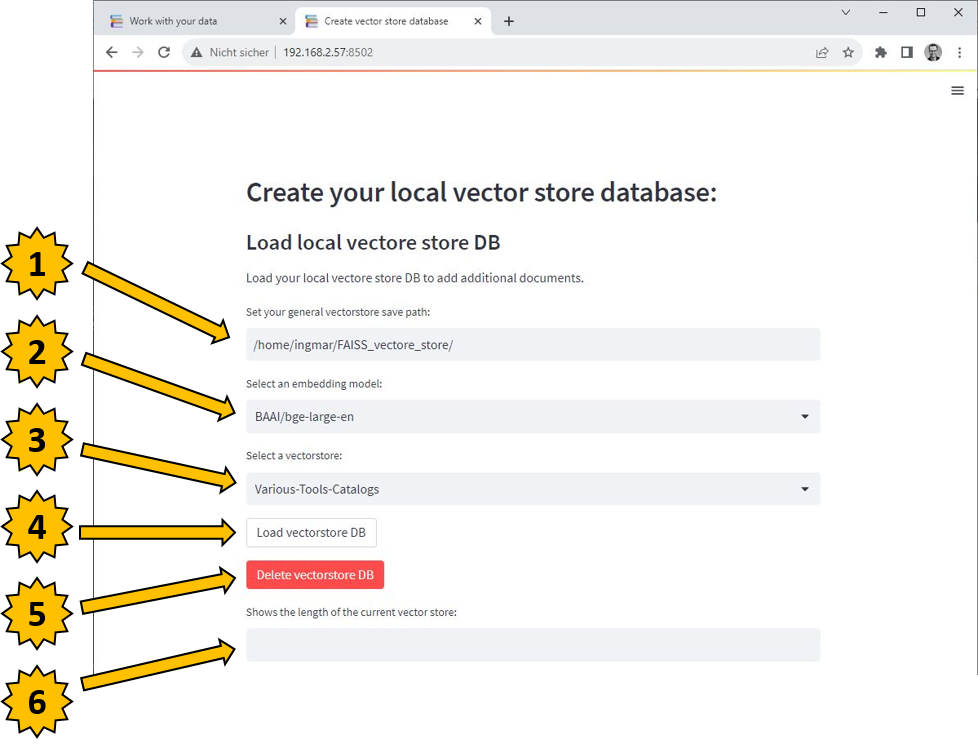
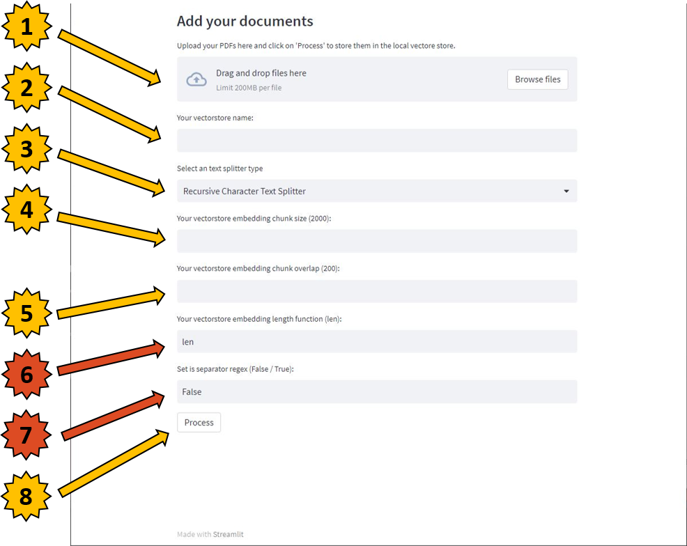

# Chat-with-multiple-PDFs-all-locally
With the here presented conversational application which falls into the category of chatting with e.g. PDF files I pursued my personal goal to work out the topic of large language models (LLM) for myself. My goal was not to simply use a service like OpenAI with the ChatGPT API but to implement everything from the selection of the language model to the startup on my own hardware. This way I had the steepest learning curve and was able to get the best understanding of how everything has to be put together and especially where the difficulties are that have to be solved. The project gave me a lot of pleasure and also showed me how important it is to prepare the texts so that they can be used in e.g. a chat mode or so that the texts can be evaluated in the sense of a mood analysis.

This is my blog: https://ai-box.eu/

Use a large language model like the META Llama 2 13B and Chat with PDF files locally on your machine.

In the following picture the application is to be seen once after this was called. To the individual functions I come now in the following chapter

1 With the dropdown menu "Select a LLM model" the user can choose between different language models. These can be specified centrally via a YAML configuration file.
2 Depending on the available hardware, the drop-down menu "Select a quantization option" allows the language model to be loaded in full or as an integer 4.
3 Depending upon technical requirement over the Dropdown menu "Select a prompt templte" between the classical Chat mode, a programming assistant and/or a text analysis in the sense is the text positive, neutral or negative to be selected.
4 With the help of the dropdown menu "Select a vector store" it is possible for me to load a vector store database that contains, for example, an API description or even a variety of guides.
5 The button "Initialize app" applies the configuration and loads the selected language model into the GPU memory.
6 After the application has been initialized, the text field can be used to ask a question that is to be answered with the help of the vector store database or to insert a text for a sentiment analysis.
7 Below the text field the user can see the chat history.

# Create your own text embeddings and local FAISS vector store
With the continuous development of the Chat with multiple PDF files applications, I quickly realized that the correct data preparation and efficient data provision are crucial success factors for the smooth functioning of these conversational applications. In this context, I had the idea and the need to develop an independent program called Create your local vector store database which exclusively prepares the data for use together with Large Language Models (LLM).

The main task of this program Create your local vector store database is to transfer texts from e.g. PDF files as text embeddings into a vector database. In the case of my application, the vector database FAISS (Facebook AI Similarity Search) is used. It was important for me when creating the text embeddings that the user has the possibility to choose from different language models that should be used for the creation of the embeddings. Also important in this context is the aspect of cutting the text into suitable parts, i.e. chunks, on the basis of which the text embeddings are created. All these requirements can be set individually in the user interface according to the business requirements.

I am curious about your reactions. The application has now reached a stage where it could be of interest to a wider audience, not only in terms of its features, but also in terms of its reliability and performance. For this reason, I have made the decision to publish this solution on GitHub. I still need to clean up the source code a bit but then I will publish everything on Git Hub.

**Note: The solution presented here runs locally and does not use any online services from e.g. OpenAI over which the data is sent. Therefore the requirement for the computer is at least a NVIDIA graphics card with 24GB Ram or 48GB Ram. I have developed the software together with a NVIDIA A6000 which performs excellent.**

The two images that follow now show the current state of this application, which was achieved by mid-September 2023.

The first part of the user interface offers the possibility to manage the vector databases. Here they can be loaded if, for example, further texts are to be added, but there is also the possibility to delete databases that are no longer needed.

## Load an already created vector store
1 Here the path is specified under which the vector databases are to be stored.
2 This drop-down menu offers the possibility to select from predefined Large Language Models (LLM) for the creation of text embeddings.
3 This drop-down menu shows all databases that have already been created.
4 The button "Load vectorestore DB" loads the selected database.
5 With the button "Delete vectorstore DB" an existing database can be deleted.
6 The length of the loaded vector database is displayed here.

## Create a new vector store

1 Here you can add files like PDF files. Once via Drag&Drop or just via the button "Brows files".
2 In this line, a meaningful name for the vector database must be specified.
3 With this drop down menu you can select how the texts should be divided.
4 Here the size of the text chunks is specified. Depending on the technical requirements and the input document, the length will vary in order to achieve the best result.
5 It is also important to find out how large the overlapping of the texts should be. It is best to try out different settings here.
6 This is a more or less static function the "len" function. Eventually this will be removed again.
7 This is a static function that currently defaults to "False" or has not yet been used.
8 The button "Process" triggers the processing, i.e. the creation of the vector database. This process can take some time depending on the number of documents and the performance of the computer.

# Setup
Please create a .env file with your Hugging Face key.
hf_auth = 'Here goes hour hf key to download the models...'
